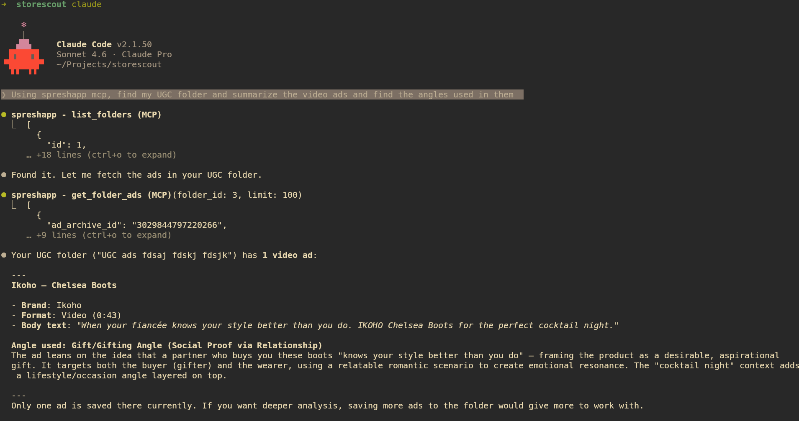
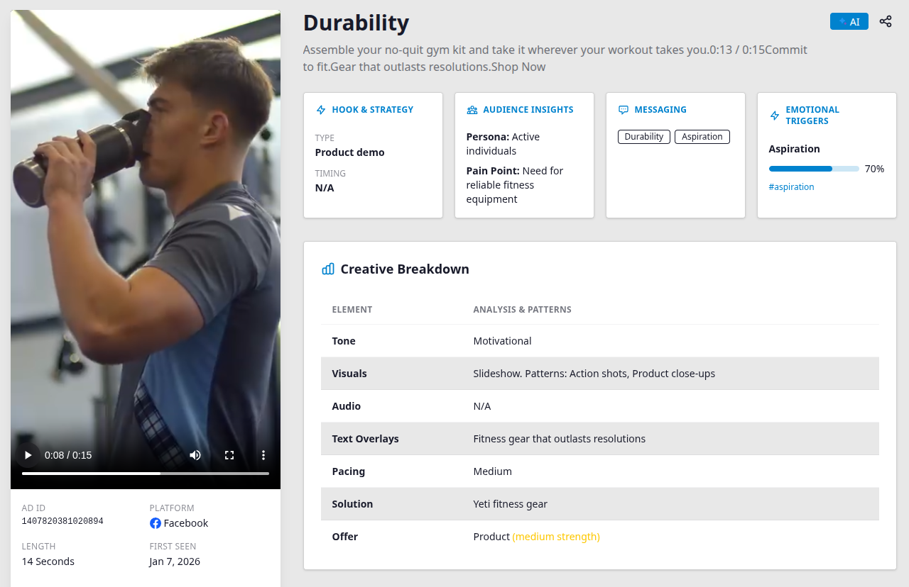
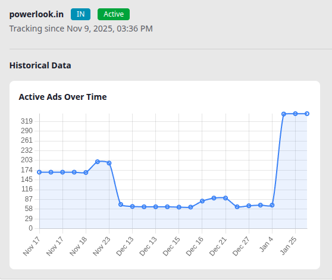

<p align="center">
  
</p>

<h1 align="center">spreshapp-mcp</h1>

<p align="center">
  MCP server that connects Claude to SpreshApp's Facebook ad intelligence platform.
  <br />
  <a href="https://www.npmjs.com/package/spreshapp-mcp"></a>
  
  
</p>

---

Ask Claude to research competitors, decode winning ad angles, track brand ad history, and analyze your saved ad library, all directly from your Claude Desktop or Claude Code session.

<p align="center">
  
</p>

## Requirements

- Node.js >= 20
- A [SpreshApp](https://spreshapp.com) account

## Setup

### Claude Desktop

Add this to your `claude_desktop_config.json` (macOS: `~/Library/Application Support/Claude/claude_desktop_config.json`):

```json
{
  "mcpServers": {
    "spreshapp": {
      "command": "npx",
      "args": ["-y", "spreshapp-mcp"]
    }
  }
}
```

Restart Claude Desktop after saving.

### Claude Code

```bash
claude mcp add spreshapp -- npx -y spreshapp-mcp
```

### VS Code (with MCP extension)

```json
{
  "mcp": {
    "servers": {
      "spreshapp": {
        "command": "npx",
        "args": ["-y", "spreshapp-mcp"]
      }
    }
  }
}
```

## Authentication

The first time the server starts it opens your browser to log in with your SpreshApp account (OAuth 2.0 with PKCE). After login, credentials are saved to `~/.spreshapp/credentials.json` (file mode 600) and refreshed automatically before each session.

If the browser does not open automatically, copy the URL printed in the terminal and paste it manually.

To log in again:

```bash
rm ~/.spreshapp/credentials.json
```

## Available Tools

### Ad tools

| Tool | Description |
|------|-------------|
| `ad_search` | Search Facebook ads by keyword, niche, or industry |
| `ad_search_expand_query` | Expand a search query to surface more relevant ads |
| `ad_get` | Fetch full details for a specific ad |
| `ad_get_analysis` | Retrieve saved AI analysis for an ad |
| `ad_analyze` | Run AI analysis on any ad |
| `ad_analyze_batch` | Analyze multiple ads in one call |
| `ad_chat` | Chat with Claude about an ad's creative strategy |

<p align="center">
  
</p>

### Brand tools

| Tool | Description |
|------|-------------|
| `brand_search` | Search for brands in SpreshApp |
| `brand_get_overview` | Get a brand's full profile and stats |
| `brand_get_status` | Get the current tracking status for a brand |
| `brand_get_ad_history` | Get historical ad volume data for a brand |
| `brand_list_active_ads` | List all ads a brand is currently running |
| `brand_follow` | Start tracking a brand |

<p align="center">
  
</p>

### Library tools

| Tool | Description |
|------|-------------|
| `search_ads` | Search your saved ad library |
| `get_folder_ads` | Get ads from a specific folder |
| `list_folders` | List all your saved folders |
| `get_tags` | List tags used across your library |
| `get_pages` | List saved Facebook pages |

## Example prompts

```
Find 10 high-performing Facebook video ads in the fitness niche and summarize the angles used.
```

```
Research Nike's current Facebook ad strategy, how many ads are they running and what are the themes?
```

```
Open my "Inspiration" folder and identify the top 3 creative hooks.
```

```
Track the brand glossier.com and show me their ad history over the last 30 days.
```

## Troubleshooting

| Symptom | Fix |
|---------|-----|
| Browser did not open | Copy the URL printed to the terminal and open it manually |
| "Authentication expired" error | Delete `~/.spreshapp/credentials.json` and re-run |
| "Not subscribed to any plan" | Visit [spreshapp.com/pricing](https://spreshapp.com/pricing) |
| "Daily limit reached" | Quota resets at midnight UTC, or upgrade your plan |
| "Feature not available" | Your current plan does not include this tool, upgrade at [spreshapp.com/pricing](https://spreshapp.com/pricing) |

## License

UNLICENSED — proprietary software. See [spreshapp.com](https://spreshapp.com) for terms.
